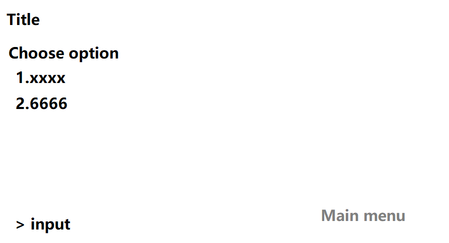
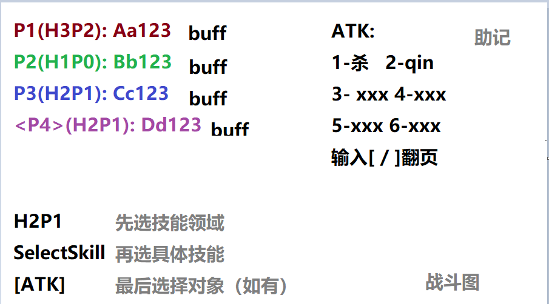

# 部分设计
## 1. 项目概述
- 项目名称：openTCK
- 项目背景：TCK是风靡于合肥一中的拍手游戏，现在需要将他电子化
- 项目目标：完成游戏并提供给小范围的玩家试玩
- 受众：小范围的玩家

## 2. 功能需求
- 主要功能: 回合制战斗，技能选择，复杂技能的相互判定
- 次要功能：网络联机功能，历史战斗榜单
- 用例图

## 3. 非功能需求
- 性能要求：回合制游戏能动就行
- 可靠性
- 可用性
- 可维护性：维护到所有技能做完的有限时间
- 可扩展性：封闭的技能设计

## 4. 系统设计
- 架构设计
- 数据设计
- 接口设计

- 流程图

## 5. 用户界面设计
- 界面原型

- 交互方式：主菜单中命令行选择功能。一些设置直接在配置文件中修改。

## 6. 技术选型
- 编程语言
- 开发工具
- 框架与库

## 7. 开发计划
- 里程碑
- 任务分配
- 时间表

## 8. 测试计划
- 测试范围
- 测试方法
- 测试用例
- 测试环境

## 9. 维护计划
- 维护内容
- 维护周期
- 维护团队

## 10. 风险分析
- 潜在风险
- 应对措施

## 11. 附录
- 参考资料
- 术语表

